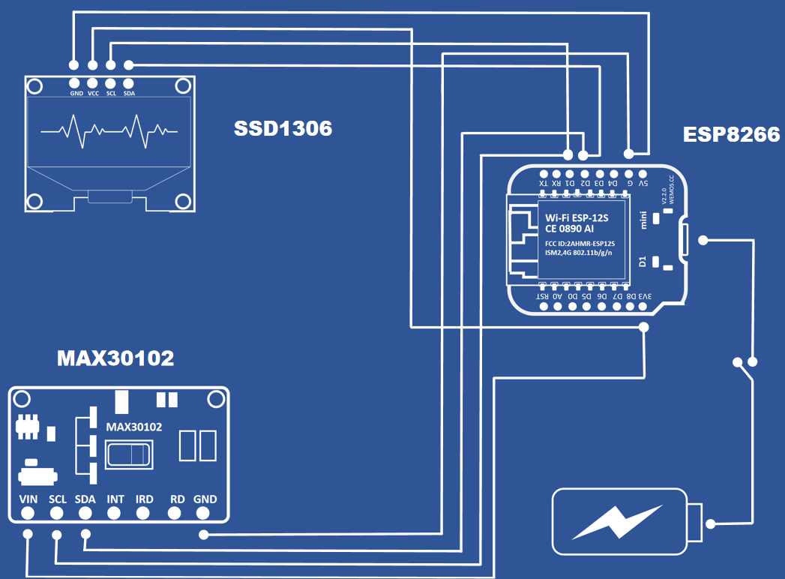

# Heart Pulse and SPO2 Monitoring System



## Overview

This project creates a real-time health monitoring device that measures:
- **Heart Rate (BPM)** - Beats per minute with live waveform display
- **Blood Oxygen Saturation (SPO2)** - Oxygen saturation percentage
- **Temperature** - Ambient temperature in Celsius

## Hardware Components

- **ESP8266** - WiFi-enabled microcontroller
- **MAX30102** - Heart rate and blood oxygen sensor
- **SSD1306 OLED Display** - 128x32 pixel display
- **DS18B20** - Temperature sensor
- **Jumper wires and breadboard**

## Features

- ✅ Real-time heart rate monitoring
- ✅ Blood oxygen saturation measurement
- ✅ Temperature display
- ✅ Live pulse waveform visualization
- ✅ Visual heartbeat LED indicator
- ✅ Advanced signal filtering for accuracy

## How to Use

1. Upload the code to your ESP8266
2. Connect all components according to the circuit diagram
3. Place your finger on the MAX30102 sensor
4. View real-time measurements on the OLED display

## Project Structure

```
├── BPM_and_SPO2/
│   └── BPM_and_SPO2.ino    # Main Arduino sketch
├── MAX30102.h/.cpp         # Sensor driver
├── Pulse.h/.cpp           # Signal processing
├── ssd1306h.h/.cpp        # Display driver
├── font.h                 # Font definitions
└── assets/
    └── CIRCUITE.png       # Circuit diagram
```

## Installation

1. Clone or download this repository
2. Open `BPM_and_SPO2.ino` in Arduino IDE
3. Install required libraries (if any)
4. Upload to your ESP8266 board

## Technical Details

The project uses custom optimized libraries for:
- **Signal Processing** - DC filtering and moving average filters
- **Beat Detection** - Advanced algorithms for heartbeat identification
- **SPO2 Calculation** - Lookup table with 184 calibrated values
- **Memory Optimization** - Efficient display and sensor management
